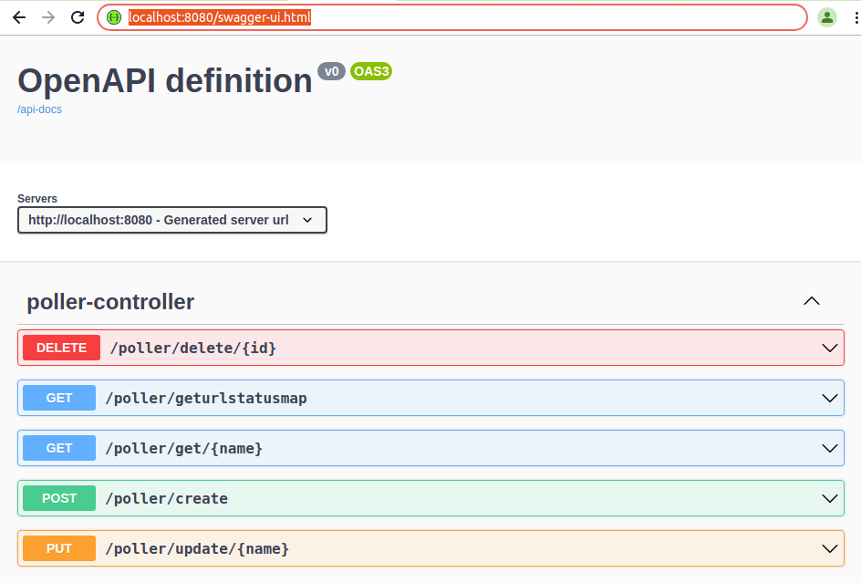
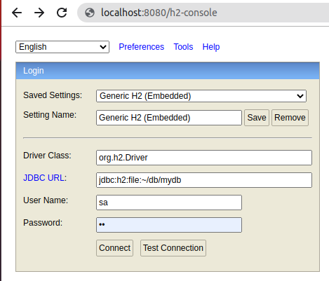
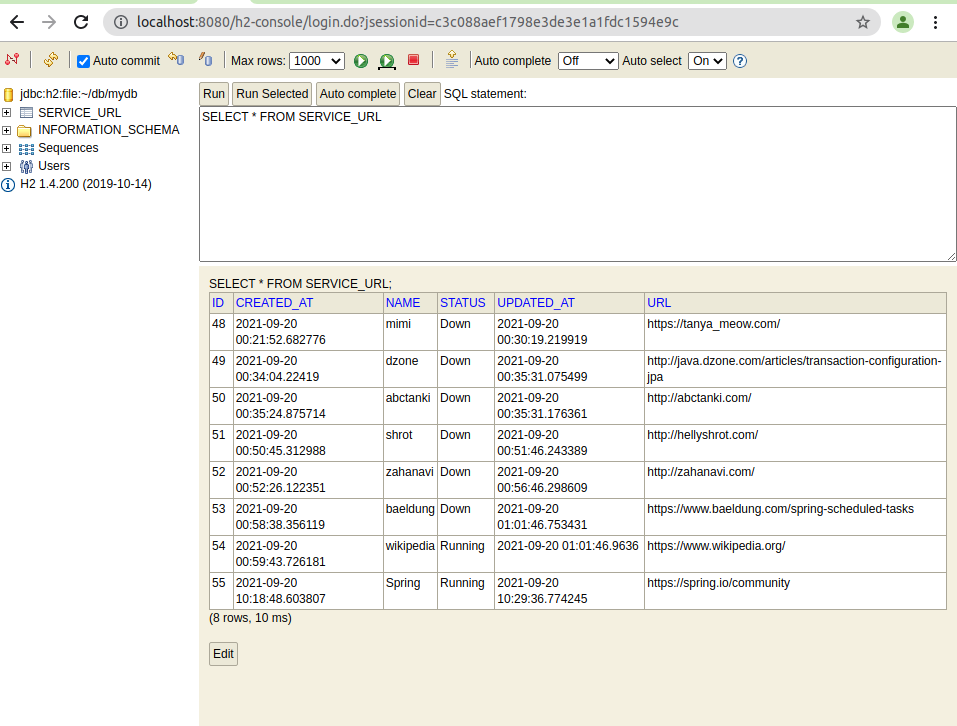
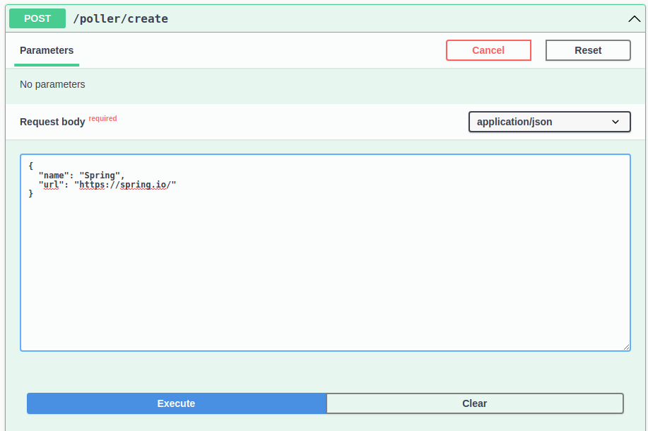
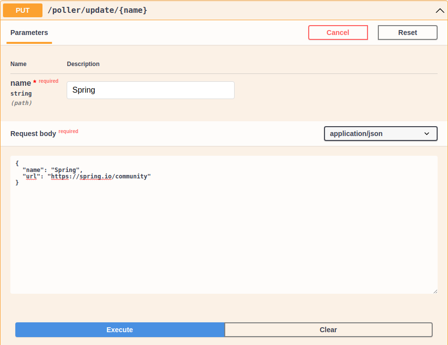
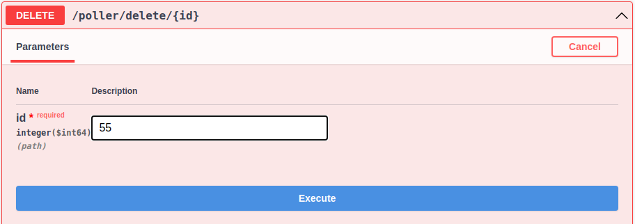
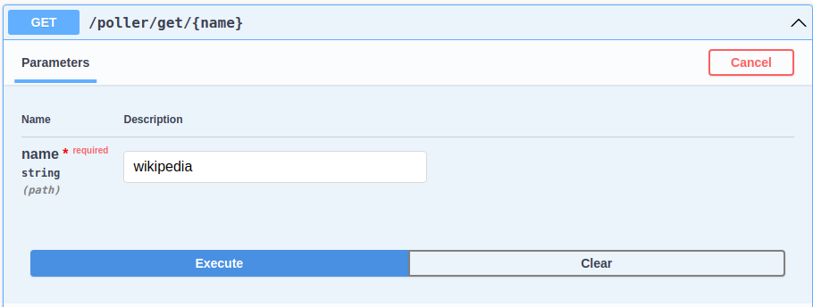
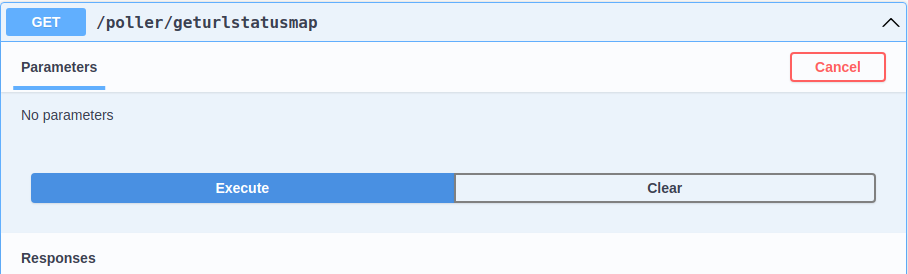
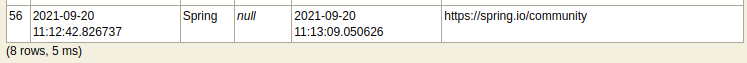
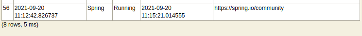

# Description
A simple service poller that keeps a list of services, and periodically does a GET request to each and
saves the response.

## Swagger
http://localhost:8080/swagger-ui.html  


## H2 Console
http://localhost:8080/h2-console  
```  
username: sa  
password: sa  
```  



## Steps to use H2 database

````  
1. Go to H2 database console http://localhost:8080/h2-console 
2. Enter username and password: sa 
3. Enter query SELECT * FROM SERVICE_URL 
4. Click on green Run button on the top
5. View all the services in the database
````



## Steps to use swagger
● Steps to Create
````  
Example of /poller/create

POST : /poller/create
1.Click on Try it out
2.Enter Request body: 
{
  "name": "name_of_service",
  "url": "http://www.url_of_the_service.com"
}
3.Click on execute.
4. In the response body:
{
  "id": 55,
  "name": "Spring",
  "url": "https://spring.io/",
  "status": null,
  "createdAt": "2021-09-20T10:18:48.603807092",
  "updatedAt": "2021-09-20T10:18:48.603856888"
}
5. Verify the service added to h2 database on h2 console

Note: the status updates autoatically
````  




● Steps to Update
````  
Example of poller/update/{name}

PUT : /poller/update/{name}
1.Click on Try it out
2. Enter name : Spring
Enter Request body: 
{
  "name": "Spring",
  "url": "https://spring.io/community"
}
3.Click on execute.
4. In the response body:
{
  "id": null,
  "name": "Spring",
  "url": "https://spring.io/community",
  "status": null,
  "createdAt": null,
  "updatedAt": null
}
5. Verify the service updated to h2 database on h2 console
````



● Steps to Delete
````  
Example of poller/delete/{id}

DELETE : /poller/delete/{id}
1.Click on Try it out
2. Enter id : 55
3.Click on execute.
4. In the response body:
ServiceUrl(id=55, name=Spring, url=https://spring.io/community, status=Running, createdAt=2021-09-20T10:18:48.603807, updatedAt=2021-09-20T10:29:36.774245)
 is Deleted successfully
5. Verify the service deleted in h2 database on h2 console
````



● Steps to Read

```` 
Example of poller/get/{name} 

GET : /poller/get/{name}
1.Click on Try it out
2. Enter name : wikipedia
3. Click on execute.
4. In the response body:
{
  "id": 54,
  "name": "wikipedia",
  "url": "https://www.wikipedia.org/",
  "status": "Running",
  "createdAt": "2021-09-20T00:59:43.726181",
  "updatedAt": "2021-09-20T01:01:46.9636"
}
5. Verify the services on h2 console
````



````  
Example of poller/geturlstatusmap

GET : /poller/geturlstatusmap
1.Click on Try it out
2.Click on execute.
3. In the response body:
{
  "http://java.dzone.com/articles/transaction-configuration-jpa": 0,
  "http://zahanavi.com/": 0,
  "https://www.wikipedia.org/": 200,
  "http://abctanki.com/": 0,
  "https://tanya_meow.com/": 0,
  "https://www.baeldung.com/spring-scheduled-tasks": 403,
  "http://hellyshrot.com/": 0
}
4. Verify the services on h2 console
````



## The scheduler service
````
The 'STATUS' of service "Spring" was 'null' by default when it was created by post.
````
Before


````
The method "scheduledStatusUpdate" updates the 'STATUS' of Service url automatically in 5 minutes
````
After 5 mins


## Technologies used
● Java 11  
● Spring boot v2.5.4  
● Spring data jpa  
● Lombok  
● MockMvc  
● Swagger v3  
● H2 database  


